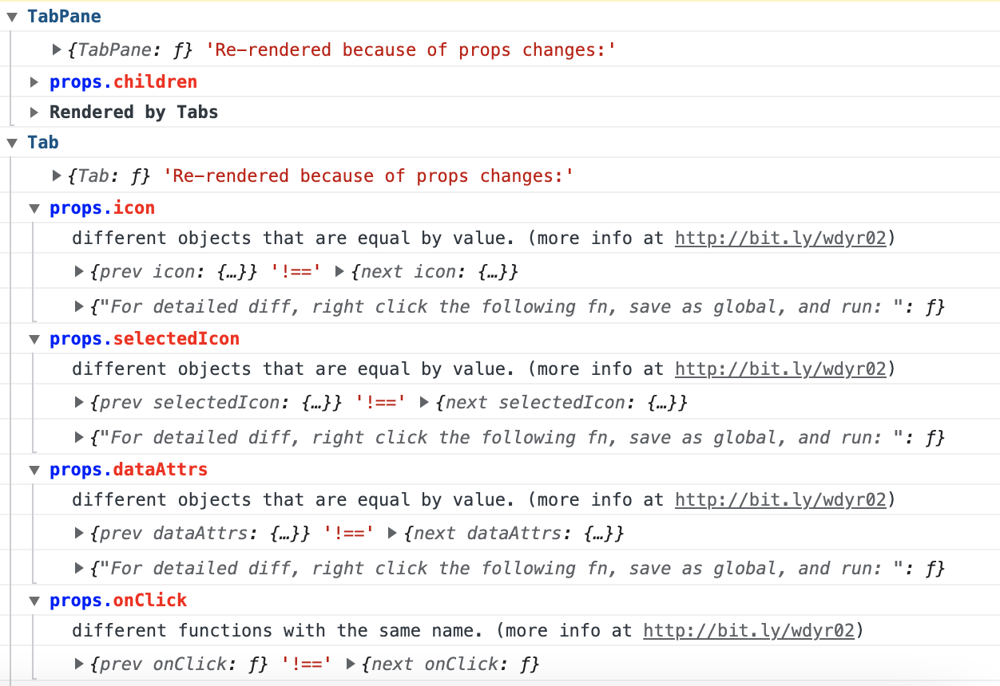

# umi-plugin-wdyr

[](https://npmjs.org/package/umi-plugin-wdyr) [](https://npmjs.org/package/umi-plugin-wdyr)

umi plugin for [why-did-you-render](https://github.com/welldone-software/why-did-you-render)

## usage

### Install

```bash
# by npm
$ npm install umi-plugin-wdyr
# by yarn
$ yarn add umi-plugin-wdyr
```

### enable whyDidYouRender

```ts
// config/config.(j|t)s or .umirc.(j|t)s
{
  // ...other configs
  whyDidYouRender: {},
}
```

You can checkout the fully config options from [why-did-you-render#options](https://github.com/welldone-software/why-did-you-render#options).

### whyDidYouRender preview


